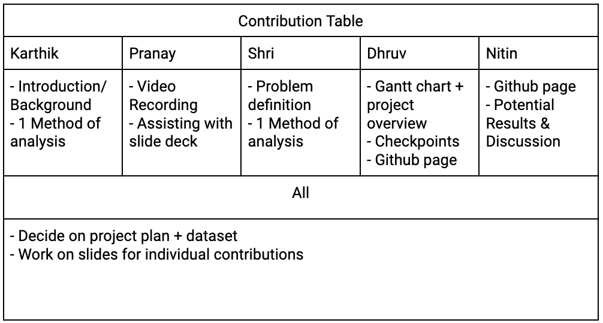

# Proposal Report

## Introduction/Background:
Phishing attacks are a social engineering tactic used to trick users into giving away personal data. In 2022, the Internet Crime Complaint Center received more than 300,000 complaints of phishing attacks, the most of any type of internet crime [1]. After obtaining sensitive information, attackers can steal the user's identity, access their bank accounts, and install malware.

Traditional approaches like two-factor authentication, personnel training and blacklists are either expensive, insufficient to handle deceptive phishing attacks, or unable to deal with short-lived webpages in time [2].

## Problem Definition:
The “Phishing Dataset for Machine Learning” [3] collects 48 features from 5000 phishing and 5000 legitimate webpages. This dataset is for anti-phishing researchers performing feature analysis, conducting proof-of-concept experiments and benchmarking their models.
Our goal is to develop an accurate and efficient classifier that can screen a web page and alert the user if they are about to access a phishing webpage. This will protect the user’s personal information and enhance their online security.
 

## Methods

### Unsupervised:

One of the algorithms we will use to identify phishing attacks is a Gaussian Mixture Model (GMM). We will be attempting to group the data into two clusters, phishing websites and legitimate websites. By using a GMM, it will allow us to capture complex clustering shapes. We will be using the sklearn.mixture package which contains a GaussianMixture object that can learn a Gaussian Mixture Model from the training dataset and give predictions. 

### Supervised:

We will also be using Support Vector Machines (SVM), supervised learning algorithms that are well suited for binary classification. Our goal will be to create a hyperplane that maximizes the margin between the points that correspond to phishing webpages and the points that do not. We’ll use the sklearn.svm package for training, testing , and evaluation, and specifying kernel and hyperparameters. SVMs work effectively in higher dimensional spaces. 
Finally, we’ll use a Random Forest that will aggregate the results of randomized decision trees. Randomization makes the model less prone to overfitting. We can use the sklearn.ensemble library, create a Classifier object and modify hyperparameters like the number of trees. 

## Potential Results/Discussion: 

### Hypothesis: 
We anticipate that the SVM model will be more robust to overfitting as compared to the random forest model and will also handle the high dimensionality of the dataset, which is where the GMM may falter. Thus, we predict that the SVM model will be the most accurate and have the lowest training time.

### Metrics:
- Accuracy
- Silhouette Coefficient 
- Precision
- Recall
- F1 Score
- Training Time

### Discussion: 
The Silhouette coefficient will be used to determine how well our GMM has clustered the dataset. The precision and recall metrics are crucial in evaluating the detection of phishing websites as it will ensure accurate labeling and safeguarding user data. Balancing these metrics is crucial for optimal user protection from malicious websites. By utilizing the F1 Score and area under the ROC curve as performance indicators, and through strategic feature engineering and model fine-tuning, we can enhance phishing detection (roughly 20% now with current techniques) while minimizing false positives on legitimate websites[4].

## Citations
[1] “Internet crime complaint center releases 2022 statistics,” FBI, https://www.fbi.gov/contact-us/field-offices/springfield/news/internet-crime-complaint-center-releases-2022-statistics (accessed Oct. 4, 2023).

[2] S. Hawa Apandi, J. Sallim, and R. Mohd Sidek, “Types of anti-phishing solutions for phishing attack,” IOP Conference Series: Materials Science and Engineering, vol. 769, no. 1, p. 012072, 2020. doi:10.1088/1757-899x/769/1/012072

[3] K. L. Chiew, C. L. Tan, K. Wong, K. S. C. Yong, and W. K. Tiong, “A New Hybrid Ensemble Feature Selection Framework for Machine Learning-based phishing detection system,” Information Sciences, vol. 484, pp. 153–166, 2019. doi:10.1016/j.ins.2019.01.064 

[4]  S. Alnemari and M. Alshammari, “Detecting phishing domains using machine learning,” Applied Sciences, vol. 13, no. 8, p. 4649, 2023. doi:10.3390/app13084649

## Contribution Table

## Project Checkpoints
Some checkpoints we can take to make sure that our dataset is allowing us to sufficiently make progress on our project revolve around making sure the dataset is large enough and has enough data quality. To monitor data quantity, we can check performance during training as if the performance levels off early on, it would indicate that a larger training data set is needed. In order to monitor data quality, we can explore the dataset to see if there are missing values or inconsistencies. If the dataset fails these checkpoints, it may serve as an indicator to explore other dataset options.

